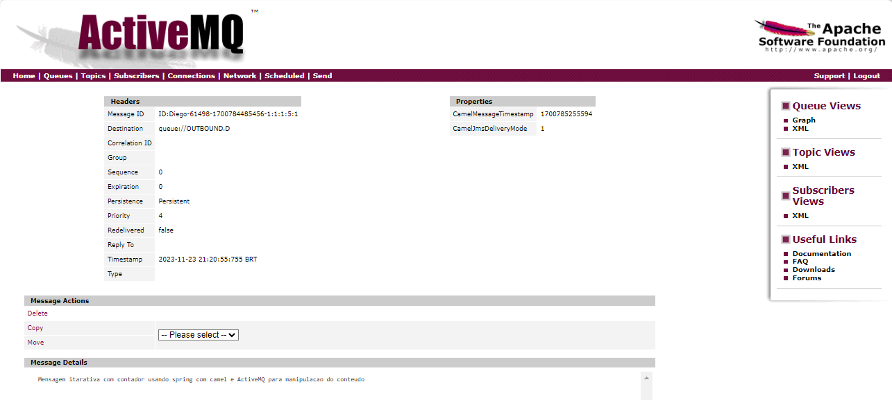

# Apache ActiveMQ

O **Apache ActiveMQ** é um sistema de mensagens de código aberto que implementa o protocolo **JMS (Java Message Service)**. Ele oferece uma infraestrutura para comunicação assíncrona entre aplicativos distribuídos. O ActiveMQ, desenvolvido em Java, é uma escolha popular para implementar soluções de mensagens em sistemas empresariais.

## Conceitos-chave

### JMS (Java Message Service)

O **Java Message Service (JMS)** é uma API Java que permite que aplicativos enviem, recebam, leiam e assinem mensagens entre si de maneira assíncrona. Ele define uma série de conceitos padrão para mensagens e fornece uma maneira de os aplicativos se comunicarem usando essas mensagens.

### Message Broker

O **ActiveMQ** atua como um *message broker*, um intermediário responsável por receber, rotear e entregar mensagens entre aplicativos. Facilita a comunicação assíncrona, permitindo que os produtores de mensagens enviem mensagens para tópicos ou filas, e os consumidores as recebam quando estiverem prontos para processar.

### Fila (Queue) e Tópico (Topic)

- **Fila**: Usadas para comunicação ponto a ponto. Cada mensagem é entregue a um único consumidor.
- **Tópico**: Usados para comunicação de um para muitos. Cada mensagem pode ser consumida por vários assinantes.

### Pool de Conexões (Connection Pooling)

O ActiveMQ permite a configuração de um *pool de conexões* para melhorar o desempenho. O `PooledConnectionFactory` é usado para criar e gerenciar conexões JMS em um ambiente de pool.

### Protocolos de Transporte

O **ActiveMQ** suporta vários protocolos de transporte, como TCP, SSL, NIO (Non-blocking I/O), entre outros. Oferece flexibilidade na configuração da forma como as mensagens são transmitidas.

Em resumo, o **Apache ActiveMQ** é uma implementação robusta do protocolo JMS que fornece uma plataforma confiável para comunicação assíncrona entre aplicativos Java em um ambiente distribuído. Amplamente utilizado em arquiteturas de sistemas distribuídos para a troca de mensagens entre diferentes componentes de software.


# Projeto Contract JMS Adapter

Este projeto implementa um adaptador JMS (Java Message Service) usando o Apache Camel para facilitar a integração entre sistemas heterogêneos por meio da troca de mensagens assíncronas. A aplicação é configurada para receber mensagens de uma fila JMS de entrada, processá-las e enviá-las para uma fila de saída, podendo repetir esse processo várias vezes.

## Estrutura do Projeto

- **JmsConfig:** Configuração do ActiveMQ e do Apache Camel para gerenciar a conexão JMS.

```java
@Configuration
public class JmsConfig {

    // ... (ver código fonte para detalhes)

}
```

- **InboundMessageProcessor:** Processador responsável por lidar com mensagens recebidas da fila de entrada.

```java
@Component
public class InboundMessageProcessor implements Processor {

     public void process(Exchange exchange) throws Exception {
    // ... (ver código fonte para detalhes)
     }
}
```

- **OutboundMessageProcessor:** Processador responsável por lidar com mensagens antes de serem enviadas para a fila de saída.

```java
@Component
public class OutboundMessageProcessor implements Processor {

     public void process(Exchange exchange) throws Exception {
    // ... (ver código fonte para detalhes)
     }
}
```

- **JmsRoute:** Roteamento das mensagens, incluindo o processamento dos processadores acima.

```java
@Component
public class JmsRoute extends RouteBuilder {

    @Override
    public void configure() throws Exception {
    // ... (ver código fonte para detalhes)
    }
}
```

- **ContractJmsadapterApplication:** Classe principal para iniciar a aplicação Spring Boot.

```java
@SpringBootApplication
public class ContractJmsadapterApplication {

	public static void main(String[] args) {
		SpringApplication.run(ContractJmsadapterApplication.class, args);
	}

}
```
####Configuração
A configuração da aplicação é gerenciada pelo arquivo application.yml. Abaixo estão algumas das principais configurações:
```yaml
spring:
  activemq:
    broker-url: tcp://localhost:61616
    pool:
      enabled: true
      max-connections: 10

max:
  concurrent:
    consumers: 2

inbound:
  endpoint: jms:INBOUND.D

outbound:
  loop:
    count: 5
  endpoint: jms:OUTBOUND.D
```

A aplicação estará ouvindo mensagens na fila de entrada configurada (**jms:INBOUND.D**), processando-as e enviando-as para a fila de saída (**jms:OUTBOUND.D**). O número de iterações é controlado pela propriedade **outbound.loop.count**.

Este projeto fornece uma estrutura básica para implementar e estender a funcionalidade do adaptador JMS conforme necessário para atender aos requisitos específicos de integração.

####Passos para iniciar o servidor ActiveMQ

Primeiro foi realizado o download do APACHE ActiveMQ através: https://activemq.apache.org/download-archives

Através dessa página é possível fazer download de versões anteriores do Apache ActiveMQ, porque nesse projeto é usado o **Java 8**, então a última versão compatível para o Java 8 foi a versão ActiveMQ **5.16.7**.

Baixado o ActiveMQ é necessário agora estar na pasta bin (**..\apache-activemq-5.16.7\bin**)
E executar o ActiveMQ através do comando
```bash
activemq start
```
Aparecerá algo semalhante a imagem abaixo, mostrando que a inicialização do ActiveMQ foi feita corretamente e disponível no http://127.0.0.1:8161/


####Como Executar

Através de realizado os passos para iniciar o servidor ActiveMQ, possivelmente
ao acessar o seguinte endereço http://127.0.0.1:8161/ pediram o login com as credenciais admin/admin para logar e assim estará na página home do ActiveMQ


E ao entrar na aba Queues, é possível criar as filas através de adicionar o **Queue Name**(nome da fila) e clicar em **Create**
É possível visualizar já duas filas também que já foram criadas:
- **INBOUND.D:** Fila de entrada, que ouve as mensagens, processa e envia para a fila de saída.
- **OUTBOUND.D:** Fila de saída, que recebe as mensagens.
Ao clicar em **Send To** irei enviar da fila de entrada configurada como **INBOUND.D** mensagem que será trafegada para a fila de saída **OUTBOUND.D:**


Com servidor ActiveMQ em execução. Em seguida, execute a aplicação Spring Boot usando o seguinte comando no terminal:

```bash
mvn spring-boot:run
```
Agora como cliquei anteriormente em **Send To** do **INBOUND.D** irei enviar a seguinte mensagem no **Message body:** "Mensagem itarativa com contador usando spring com camel e ActiveMQ para manipulacao do conteudo" e envie com **Send**.
E usando a api **contract-jmsadapter** para realizar essas integrações.


Ao enviar a mensagem e visualizando no log da aplicação


Ao retornar a lista de filas (queues) temos a fila **OUTBOUND.D** e ao clicando no **OUTBOUND.D** temos as informações da fila de saída referente a lista de mensagens de saída, sendo possível ver na imagem:


E ao clicar em um dos IDs das mensagens, as informações da mensagem são detalhadas como visto na imagem a seguir:

